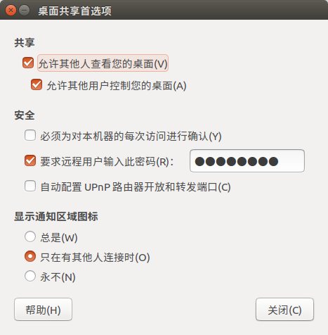
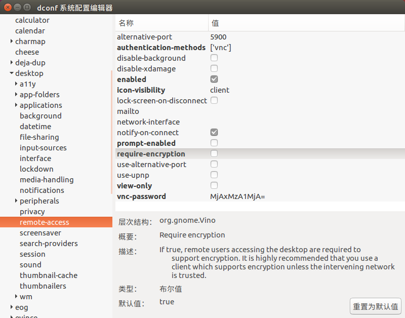

# 使用vnc viewer 从windows远端ubuntu
## 1. ubuntu打开桌面共享



勾选```允许其他人查看您的桌面```， 安全选择第二项```要求远程用户输入此密码```

## 2. 安装dconf-editor，并配置
> ```sudo apt-get install dconf-editor```
>  运行```dconf-editor```，或在Dash中打开dconf配置
> 依次展开 org > gnome > desktop > remote-access
> 这里也可以设置远程控制选项，但重要的是将**```"require-encryption"```**取消掉



## 3. 回到windows，下载vnc viewer 进行连接

[vnc viewer下载连接](https://www.realvnc.com/en/connect/download/viewer/windows/) 

下载后直接双击运行，输入linux系统的ip进行连接，然后输入密码连接成功