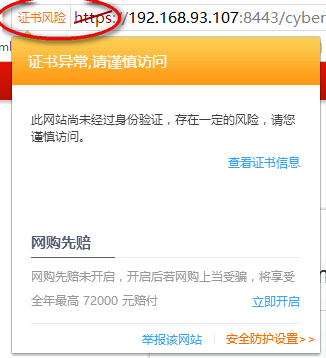
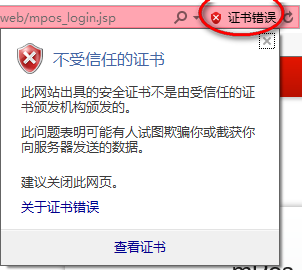
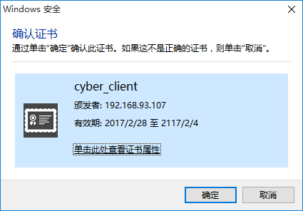

# Tomcat添加双向认证
## 1 配置Tomcat服务为https访问和单向认证
### 1.1 在Tomcat的根目录下找到/conf/server.xml文件打开，找到如下位置

    
​    
### 1.2 这段配置修改为如下配置
```xml
    <Connector port="8443" 
      protocol="org.apache.coyote.http11.Http11Protocol" 
      maxThreads="150"  
      SSLEnabled="true"  
      scheme="https"  
      secure="true" 
      keystoreFile="C:\mPosInstall\keystore"  
      keystorePass="server"
      clientAuth="false"  
      sslProtocol="SSL"  
      ciphers="TLS_ECDHE_ECDSA_WITH_AES_128_GCM_SHA256,
                    TLS_ECDHE_RSA_WITH_AES_128_GCM_SHA256,
                    TLS_DHE_RSA_WITH_AES_128_GCM_SHA256,
                    TLS_ECDHE_ECDSA_WITH_AES_256_CBC_SHA,
                    TLS_ECDHE_ECDSA_WITH_AES_128_CBC_SHA,
                    TLS_ECDHE_RSA_WITH_AES_128_CBC_SHA, 
                    TLS_ECDHE_RSA_WITH_AES_256_CBC_SHA, 
                    TLS_ECDHE_ECDSA_WITH_RC4_128_SHA, 
                    TLS_ECDHE_RSA_WITH_RC4_128_SHA, 
                    TLS_DHE_RSA_WITH_AES_128_CBC_SHA,
                    TLS_DHE_DSS_WITH_AES_128_CBC_SHA,
                    TLS_DHE_RSA_WITH_AES_256_CBC_SHA, 
                    TLS_RSA_WITH_AES_128_GCM_SHA256,
                    TLS_RSA_WITH_AES_128_CBC_SHA,
                    TLS_RSA_WITH_AES_256_CBC_SHA,
                    TLS_RSA_WITH_3DES_EDE_CBC_SHA,
                    TLS_RSA_WITH_RC4_128_SHA,
                    TLS_RSA_WITH_RC4_128_MD5" 
        sslEnabledProtocols="TLSv1.2" />
```
这段配置中`keystoreFile="C:\mPosInstall\keystore"   keystorePass="server"`
需要根据自己的证书进行调整，其中keystoreFile 可以使用相对路径
### 1.3 在本地配置信任证书





现在这个网站是可以访问的，但是会提示证书风险，这是使用360和IE访问的情况，现在可以点击查看证书，将证书安装到“受信任的根证书颁发机构”目录下，之后重启浏览器访问，这个证书异常就会消失

## 2 双向认证的配置
### 2.1 修改/conf/server.xml文件，上次修改的地方修改如下

```xml
<Connector port="443"  
       protocol="org.apache.coyote.http11.Http11Protocol" 
       maxThreads="150"  
       SSLEnabled="true"  
       scheme="https" 
       secure="true" 
       keystoreFile="C:\mPosInstall\keystore" 
       keystorePass="server" 
       truststoreFile="C:\mPosInstall\client.truststore"
       truststorePass="server"
       clientAuth="true"  
       sslProtocol="SSL"  
       ciphers="TLS_ECDHE_ECDSA_WITH_AES_128_GCM_SHA256, 
                    TLS_ECDHE_RSA_WITH_AES_128_GCM_SHA256,
                    TLS_DHE_RSA_WITH_AES_128_GCM_SHA256, 
                    TLS_ECDHE_ECDSA_WITH_AES_256_CBC_SHA, 
                    TLS_ECDHE_ECDSA_WITH_AES_128_CBC_SHA,
                    TLS_ECDHE_RSA_WITH_AES_128_CBC_SHA,
                    TLS_ECDHE_RSA_WITH_AES_256_CBC_SHA,
                    TLS_ECDHE_ECDSA_WITH_RC4_128_SHA,
                    TLS_ECDHE_RSA_WITH_RC4_128_SHA, 
                    TLS_DHE_RSA_WITH_AES_128_CBC_SHA,
                    TLS_DHE_DSS_WITH_AES_128_CBC_SHA,
                    TLS_DHE_RSA_WITH_AES_256_CBC_SHA,
                    TLS_RSA_WITH_AES_128_GCM_SHA256, 
                    TLS_RSA_WITH_AES_128_CBC_SHA,
                    TLS_RSA_WITH_AES_256_CBC_SHA,
                    TLS_RSA_WITH_3DES_EDE_CBC_SHA,
                    TLS_RSA_WITH_RC4_128_SHA,
                    TLS_RSA_WITH_RC4_128_MD5" 
        sslEnabledProtocols="TLSv1.2" />
```

添加属性有`truststoreFile="C:\mPosInstall\client.truststore" truststorePass="server"`
client.truststore里面放的是信任客户端的证书
修改属性有  `clientAuth="true"`
修改完成重启tomcat

### 2.2 添加本地私钥
现在访问网站发现无法访问了，还不明白怎么回事，但你用Chrome访问时，还有一个提示： **XX网站不接受您的登录证书，或者您可能没有提供登录证书。**
先打开如下画面IE：internet选项→内容→证书
其他浏览器：选项→管理证书


点击导入，把自己制作的P12证书放入到“个人”目录下。注意：导入时要输入证书密码
这个时候在刷新页面就会看到如下画面，(由浏览器而定)




点击确定以后，就可以访问成功了.(部分浏览器导入密钥后可能需要重启浏览器)

## 3 附上生成证书需要的bat内容

```bat
set SERVER_DN="CN=192.168.XXX.XXX, OU=cybersoft.com, O=cybersoft, L=CN, S=CN, C=CN" 
set CLIENT_DN="CN=cybersoft.com.tw, OU=cybersoft.com, O=cybersoft, L=CN, S=CN, C=CN"
set PASS_SET="client"
set SPASS_SET="server"
set CER_ROOT_PATH="e:\SSL"
:: 路径不存在则创建路径
if not exist %CER_ROOT_PATH% md %CER_ROOT_PATH%

::制作 keystore
keytool -genkey -alias cyber_server -keyalg RSA -keystore %CER_ROOT_PATH%/keystore -dname %SERVER_DN% -storepass %SPASS_SET% -keypass %SPASS_SET% -validity 36500

keytool -genkey -alias cyber_client -keyalg RSA -storetype PKCS12 -keystore %CER_ROOT_PATH%/client.key.p12 -dname %SERVER_DN% -keypass %PASS_SET% -storepass %PASS_SET% -validity 36500

keytool -export -alias cyber_server -keystore %CER_ROOT_PATH%/keystore -storepass %SPASS_SET% -rfc -file %CER_ROOT_PATH%/server.cer

keytool -export -alias cyber_client -storetype PKCS12 -keystore %CER_ROOT_PATH%/client.key.p12 -storepass %PASS_SET% -rfc -file %CER_ROOT_PATH%/client.cer

keytool -import -file %CER_ROOT_PATH%/server.cer -storepass %PASS_SET% -keystore %CER_ROOT_PATH%/truststore.jks -noprompt

keytool -import -file %CER_ROOT_PATH%/client.cer -storepass %SPASS_SET% -keystore %CER_ROOT_PATH%/client.truststore -noprompt

pause

```

其中`192.168.XXX.XXX`，请修改为自己的域名或IP
运行后生成的文件在e:\SSL，目录结构为


其中keystore和client.truststore是在tomcat中配置的
client.key.p12需要在客户端导入到“个人”目录中
