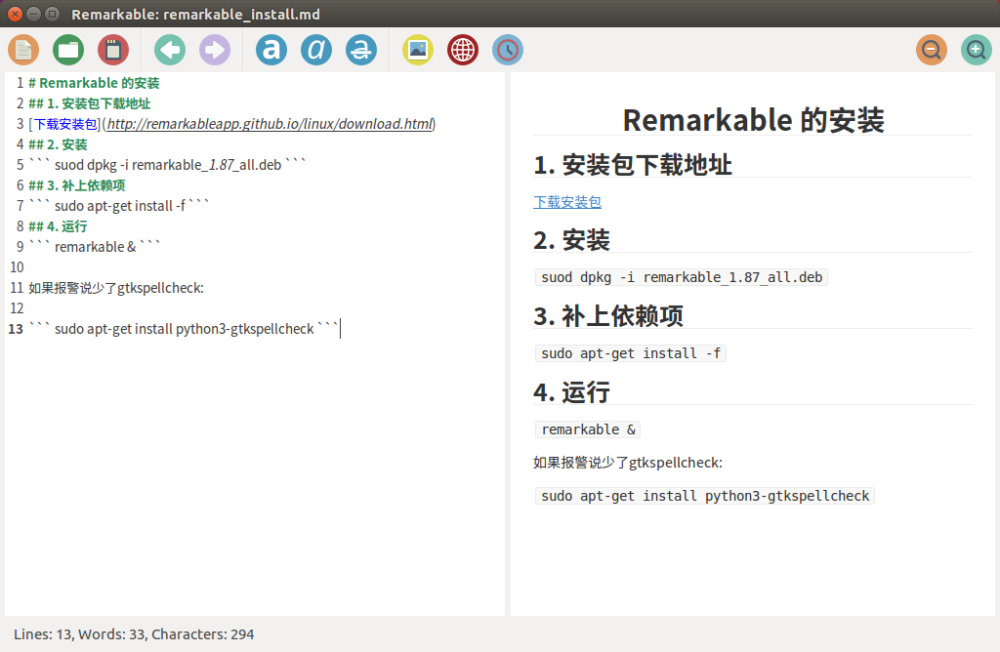

# Remarkable 的安装
## 1. 安装包下载地址
[下载安装包](http://remarkableapp.github.io/linux/download.html) 
## 2. 安装
``` suod dpkg -i remarkable_1.87_all.deb ```
## 3. 补上依赖项
``` sudo apt-get install -f ```
## 4. 运行
``` remarkable & ```



如果报警说少了gtkspellcheck:

``` sudo apt-get install python3-gtkspellcheck ```