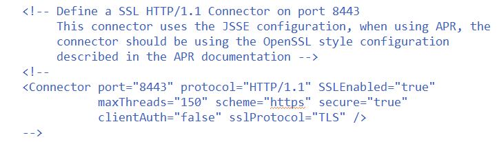

# Tomcat添加双向认证
1. 配置Tomcat服务为https访问和单向认证
    1. 在Tomcat的根目录下找到/conf/server.xml文件打开，找到如下位置
    
    2. 这段配置修改为如下配置
    '''java
    <Connector port="8443" 
      protocol="org.apache.coyote.http11.Http11Protocol" 
      maxThreads="150"  
      SSLEnabled="true"  
      scheme="https"  
      secure="true" 
      keystoreFile="C:\mPosInstall\keystore"  
      keystorePass="server"
      clientAuth="false"  
      sslProtocol="SSL"  
      ciphers="TLS_ECDHE_ECDSA_WITH_AES_128_GCM_SHA256,
                    TLS_ECDHE_RSA_WITH_AES_128_GCM_SHA256,
                    TLS_DHE_RSA_WITH_AES_128_GCM_SHA256,
                    TLS_ECDHE_ECDSA_WITH_AES_256_CBC_SHA,
                    TLS_ECDHE_ECDSA_WITH_AES_128_CBC_SHA,
                    TLS_ECDHE_RSA_WITH_AES_128_CBC_SHA, 
                    TLS_ECDHE_RSA_WITH_AES_256_CBC_SHA, 
                    TLS_ECDHE_ECDSA_WITH_RC4_128_SHA, 
                    TLS_ECDHE_RSA_WITH_RC4_128_SHA, 
                    TLS_DHE_RSA_WITH_AES_128_CBC_SHA,
                    TLS_DHE_DSS_WITH_AES_128_CBC_SHA,
                    TLS_DHE_RSA_WITH_AES_256_CBC_SHA, 
                    TLS_RSA_WITH_AES_128_GCM_SHA256,
                    TLS_RSA_WITH_AES_128_CBC_SHA,
                    TLS_RSA_WITH_AES_256_CBC_SHA,
                    TLS_RSA_WITH_3DES_EDE_CBC_SHA,
                    TLS_RSA_WITH_RC4_128_SHA,
                    TLS_RSA_WITH_RC4_128_MD5" 
        sslEnabledProtocols="TLSv1.2" />'''
